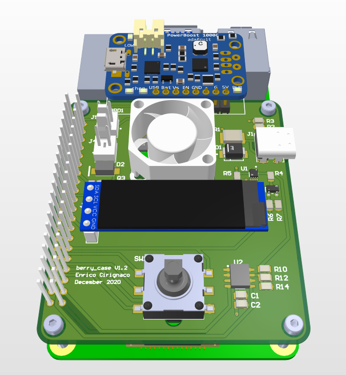
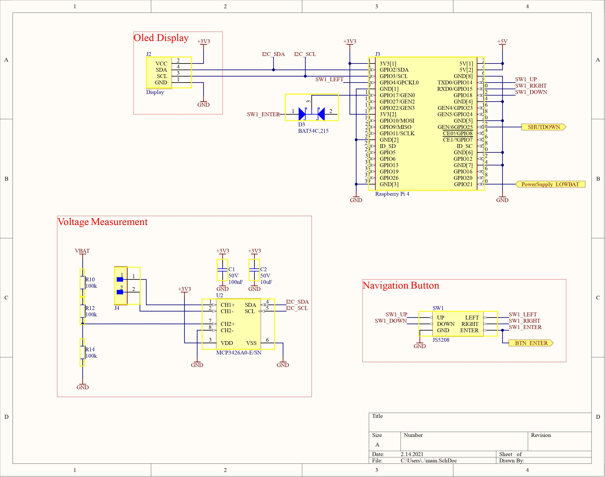
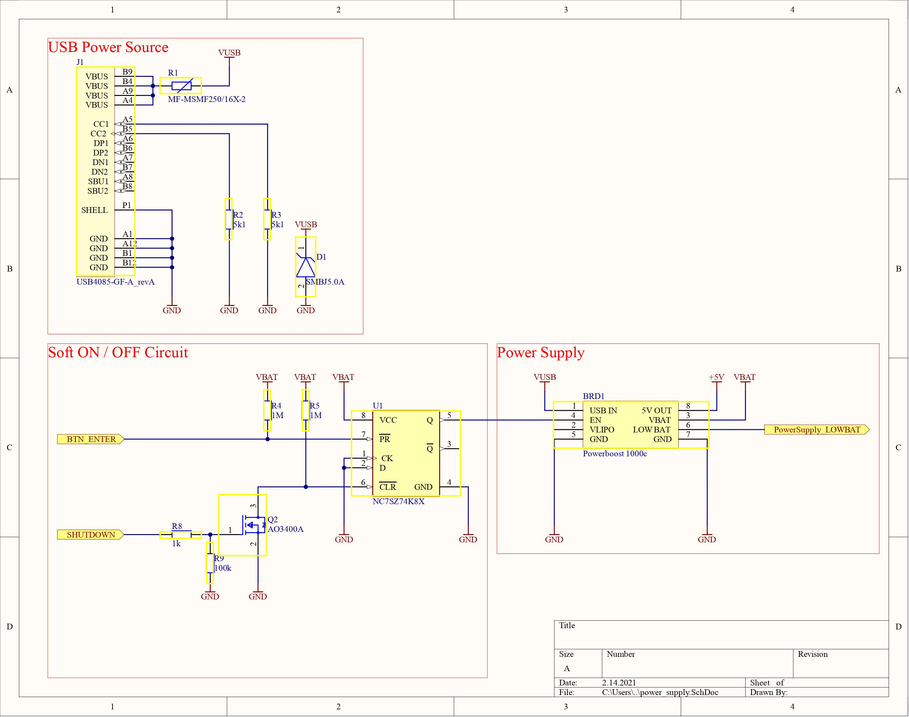

<!--
*** Thanks for checking out this README Template. If you have a suggestion that would
*** make this better, please fork the berry_case and create a pull request or simply open
*** an issue with the tag "enhancement".
*** Thanks again! Now go create something AMAZING! :D
***
***
***
*** To avoid retyping too much info. Do a search and replace for the following:
*** enricocirignaco(github_username), berry_case(repo), e.cirignaco@gmail.com(email)
-->

<!-- PROJECT LOGO -->
 

    
  </a>

  <h2 align="center">berry_case</h2>

  

    The open source Raspberry Pi case without compromises made by the community for the communnity
     
     
    <a href="https://github.com/enricocirignaco/berry_case/issues">Report Bug</a>
    ·
    <a href="https://github.com/enricocirignaco/berry_case/issues">Request Feature</a>
  

<!-- TABLE OF CONTENTS -->
## Table of Contents

* [About the Project](#about-the-project)
  * [Starting Situation](#starting-situation)
  * [Aim](#aim)
  * [Product Requirements](#product-requirements)
  * [Current Status](#curent-status)
* [Getting Started](#getting-started)
  * [Toolchain](#Toolchain)
  * [Hardware](#hardware)
  * [Firmware](#firmware)
  * [Sofware(Linux)](#software)
    * [Prerequisites](#prerequisites)
    * [Installation](#installation)
* [Usage](#usage)
* [Contributing](#contributing)
* [License](#license)
* [Contact](#contact)

<!-- ABOUT THE PROJECT -->
# About The Project
An affordable and open source case for the Raspberry Pi 4 to help the users became more productive and portable then ever.

## Starting Situation

Surfing on the net I discovered some very cool case solutions for the RPi4. I almost ordered one of those products (Argon One). But then I realized that when the RPi4 was powered by a Power Bank(almost always in my case)(5V@2.1A) the CPU had some serious throttling problems. So overclocking with this power supply was out of discussion. I searched for an alternative battery powered power supply(5.2V@3A). Without success.
At the same time I discovered some interesting "Half-solutions":
* [Argon One](https://www.argon40.com/argon-one-raspberry-pi-4-case.html) (very nice design, power button, cooling system)
* [Acrylic Raspberry Pi set-top box kit](https://wiki.52pi.com/index.php/Acrylic_Raspberry_Pi_set-top_box_kit_SKU:_ZP-0098) (all IOs on the back, full dual HDMI)
* [Raspberry Pi RGB Cooling HAT](https://www.yahboom.net/study/RGB_Cooling_HAT) (OLED dipslay with IP address, CPU temp, etc)
* [Adafruit PowerBoost 1000 Charger](https://www.adafruit.com/product/2465) (UPS solution with Li-Ion cell, power supply)

So I decided to take inspiration from all this product and make my own solution! :)

## Aim
Develop and Build an affordable, open source, smart and good looking case for the Raspberry Pi 4.
Make good documentation and a building guide available to everyone so that anyone can build ther own case at home.
Find someone on github to collaborate with.

## Product Reqirements
* Size: max double the footprint of the RPi4. Max height not defined.
* Battery: min 2 hours of battery life.
* Cooling System: capable of cooling Overclocked RPi4.
* Power Button: capable of Soft and Hard Shutdown.
* PSU: UPS, BMS and 5.2V@min 2A output supply.
* Accessible GPIOs

## Current Status (15.01.2020)
Version 1.2 of the PCB is done. Software still in alpha phase. At the moment I'm focused on the Enclosure. I'm testing different 3D printed cases for the RPi4.

# Hardware
The PCB is developed with [Altium Designer](https://altium.com).
## Schematics
### Main

### Power Supply

# Software
## Prerequisites
## Installation
## Usage
# Mechanic
The 3D Models are developed with [Autodesk Fuson 360](https://www.autodesk.com/products/fusion-360/overview)

# Sources
[datasheet oled display](https://www.mcielectronics.cl/website_MCI/static/documents/0.91inch_OLED_Module_User_Manual_EN.pdf)

[auto power off](http://crsengineering.altervista.org/eng/pi/pi_GPIO_poweroff_eng.html)

[networking tool](https://www.raspberryconnect.com/projects/65-raspberrypi-hotspot-accesspoints/183-raspberry-pi-automatic-hotspot-and-static-hotspot-installer)

# Contributing

I'm looking for someone that want to collaborate in this project. **Especially someone tha is good at 3D drawing.** I would like to get in touch with you if you are interested. :)

Contributions are what make the open source community such an amazing place to be learn, inspire, and create. Any contributions you make are greatly appreciated.

1. Fork the Project
2. Create your Feature Branch (`git checkout -b feature/AmazingFeature`)
3. Commit your Changes (`git commit -m 'Add some AmazingFeature'`)
4. Push to the Branch (`git push origin feature/AmazingFeature`)
5. Open a Pull Request

# License

# Contact

Enrico Cirignaco - e.cirignaco@gmail.com

Project Link: [https://github.com/enricocirignaco/berry_case](https://github.com/enricocirignaco/berry_case)
