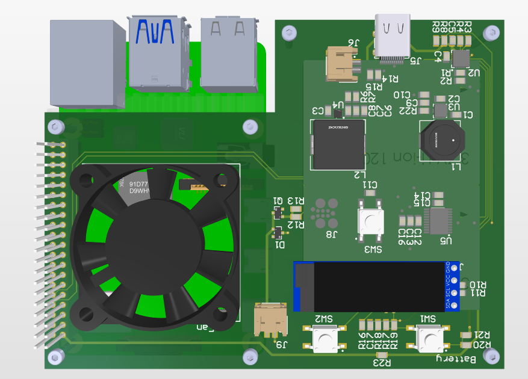
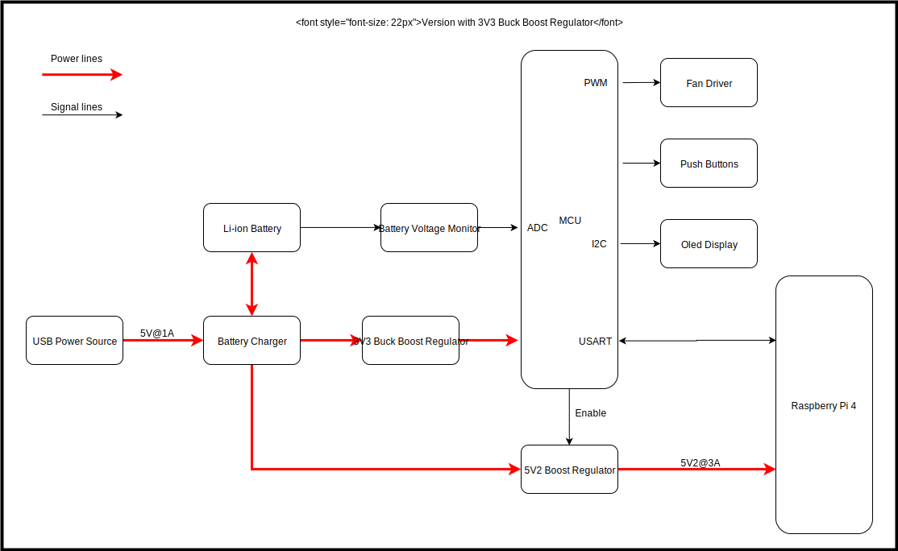
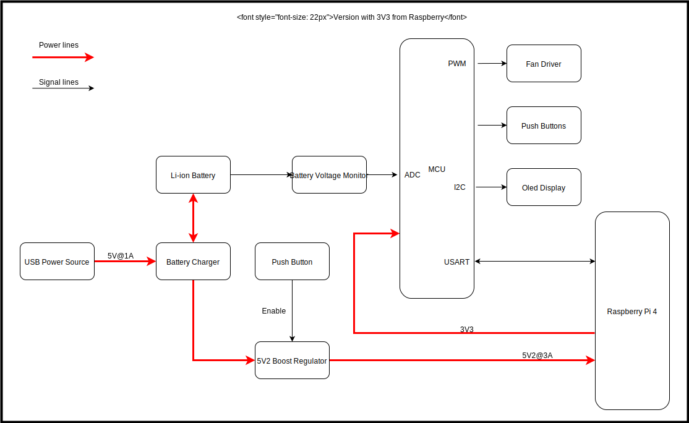

<!--
*** Thanks for checking out this README Template. If you have a suggestion that would
*** make this better, please fork the berry_case and create a pull request or simply open
*** an issue with the tag "enhancement".
*** Thanks again! Now go create something AMAZING! :D
***
***
***
*** To avoid retyping too much info. Do a search and replace for the following:
*** enricocirignaco(github_username), berry_case(repo), e.cirignaco@gmail.com(email)
-->

<!-- PROJECT LOGO -->
 

    
  </a>

  <h2 align="center">berry_case</h2>

  

    The open source Raspberry Pi case without compromises made by the community for the communnity
     
     
    <a href="https://github.com/enricocirignaco/berry_case/issues">Report Bug</a>
    ·
    <a href="https://github.com/enricocirignaco/berry_case/issues">Request Feature</a>
  

<!-- TABLE OF CONTENTS -->
## Table of Contents

* [About the Project](#about-the-project)
  * [Starting Situation](#starting-situation)
  * [Aim](#aim)
  * [Product Requirements](#product-requirements)
  * [Current Status](#curent-status)
* [Getting Started](#getting-started)
  * [Toolchain](#Toolchain)
  * [Hardware](#hardware)
  * [Firmware](#firmware)
  * [Sofware(Linux)](#software)
    * [Prerequisites](#prerequisites)
    * [Installation](#installation)
* [Usage](#usage)
* [Contributing](#contributing)
* [License](#license)
* [Contact](#contact)

<!-- ABOUT THE PROJECT -->
# About The Project
Develop and Build an affordable and open source case for the Raspberry Pi 4 to help the users to become more productive then ever.

### Starting Situation

Surfing on the net I discovered some very cool case solutions for the RPi4. I almost ordered one of those products (Argon One). But then I realized that when the RPi4 was powered by a Power Bank(almost always in my case)(5V@2.1A) the CPU had some serious throttling problems. So overclocking with this power supply was out of discussion. I searched for an alternative battery powered power supply(5.2V@3A). Without success.
At the same time I discovered some interesting "Half-solutions":
* [Argon One](https://www.argon40.com/argon-one-raspberry-pi-4-case.html) (very nice design, power button, cooling system)
* [Acrylic Raspberry Pi set-top box kit](https://wiki.52pi.com/index.php/Acrylic_Raspberry_Pi_set-top_box_kit_SKU:_ZP-0098) (all IOs on the back, full dual HDMI)
* [Raspberry Pi RGB Cooling HAT](https://www.yahboom.net/study/RGB_Cooling_HAT) (OLED dipslay with IP address, CPU temp, etc)
* [Adafruit PowerBoost 1000 Charger](https://www.adafruit.com/product/2465) (UPS solution with Li-Ion cell, power supply)

So I decided to take inspiration from all this product and make my own solution! :)

### Aim
Develop and Build an affordable, open source, smart and good looking case for the Raspberry Pi 4.
Make good documentation and a building guide available to everyone so that anyone can build ther own case at home.
Find someone on github to collaborate with (I'm new on the platform).

### Product Reqirements
* Size: max double the footprint of the RPi4. Max height not defined.
* Battery: min 2 hours of battery life.
* Cooling System: capable of cooling Overclocked RPi4.
* Power Button: capable of Soft and Hard Shutdown.
* PSU: UPS, BMS and 5.2V@min 2A output supply.
* Accessible GPIOs

### Current Status
At the moment PCB V0.1 is beeing manufactured. I'm waiting for the board to start testing. In the version 0.1 only the upper board is beeing developed. The bottom PCB(only function is to take HDMI and Audio ports to the back) will be developed with Version 0.2 or 1.0 because it only need minor testing.
At the moment no Firmware or Software is in development.

# Getting Started
### Toolchain

* [Altium Designer](https://altium.com)
* [Visual Studio Code](https://code.visualstudio.com/)
* [STM32CubeMX](https://www.st.com/en/development-tools/stm32cubemx.html)
* [Autodesk Fuson 360](https://www.autodesk.com/products/fusion-360/overview)

### Hardware
* [Schematics](docs/pcb_schematics.PDF)
* [Assembly documentation](docs/pcb_assembly.PDF)

During hardware development two major solution where taken into considaration.
Both solutions where integrated on V0.1 in order to test both. To separate the circuits 0ohm resistors where used.
##### Always ON MCU powered by on board 3V3 Buck Boost Regolator
In this solution the MCU and the 3V3 regulator can't be turned OFF (sleep mode available). MCU wait for an interrupt triggered by a push button. Then it enables 5V2 Regulator and therefore power up the Raspberry. 
* **Downsides**
  * 3V3 Regulator and MCU still draw current when device is turned OFF.
  * Expensive(3V3 Regulator)

* **Upsides**
  * Simpler circuit
  * More reliable system

##### MCU powered by Raspberry on board 3V3 regulator
In this solution no 3V3 Regulator is needed and MCU can be turned OFF. MCU is powered by the Raspberry on board 3V3 Regulator.
By pressing a push button a capacitor is charged and the 5V2 Regulator is activated. The Raspberry and therefore the MCU are powered up. As soon as the MCU is started the 5V2 Regulator is kept enabled until the system is turned OFF. The capacitor is needed to bypass the time needed by the MCU to power up.
* **Downsides**
  * Circuit need to be tested (proof of concept)

* **Upsides**
  * MCU completely turned off when device is turned off.
  * Cheaper(no 3V3 Regulator needed)

## Firmware
### OLED Display
https://www.mcielectronics.cl/website_MCI/static/documents/0.91inch_OLED_Module_User_Manual_EN.pdf
https://controllerstech.com/oled-display-using-i2c-stm32/
https://github.com/adafruit/Adafruit_CircuitPython_SSD1306
### auto power off
http://crsengineering.altervista.org/eng/pi/pi_GPIO_poweroff_eng.html
### network tool
https://www.raspberryconnect.com/projects/65-raspberrypi-hotspot-accesspoints/183-raspberry-pi-automatic-hotspot-and-static-hotspot-installer
### Software (Linux)
#### Prerequisites
#### Installation
## Usage

## Contributing

I'm looking for someone that want to collaborate in this project. I would like to get in touch with you if you are interested. :)

Contributions are what make the open source community such an amazing place to be learn, inspire, and create. Any contributions you make are greatly appreciated.

1. Fork the Project
2. Create your Feature Branch (`git checkout -b feature/AmazingFeature`)
3. Commit your Changes (`git commit -m 'Add some AmazingFeature'`)
4. Push to the Branch (`git push origin feature/AmazingFeature`)
5. Open a Pull Request

## License

## Contact

Enrico Cirignaco - e.cirignaco@gmail.com

Project Link: [https://github.com/enricocirignaco/berry_case](https://github.com/enricocirignaco/berry_case)
