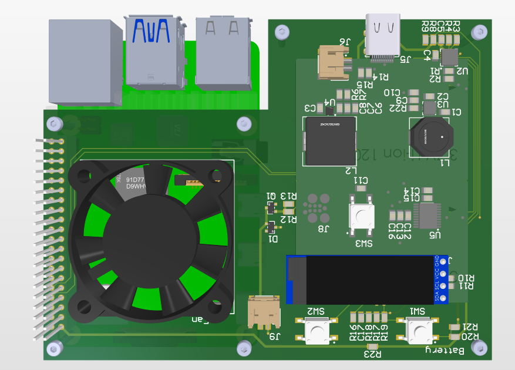
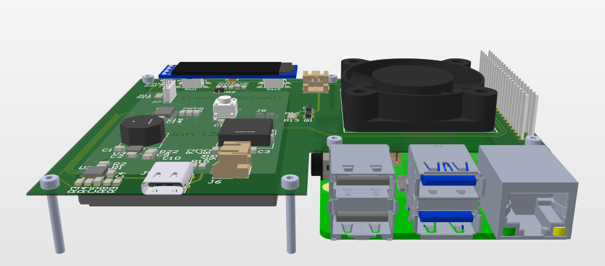

# berry_case
I want to develop a case for the Raspberry Pi 4 that include Internal Battery, All IOs on one side, access to GPIO, Cooling system for overclocking, power button and eventually OLED Display.

